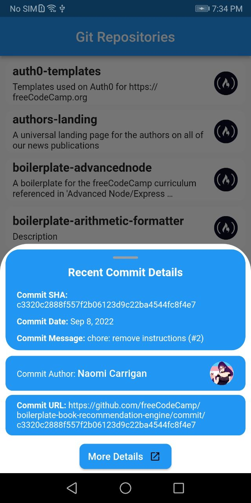

# urban_task

A new Flutter project.

## Getting Started

This project is made using GetX state Management.
The arcitecture having service layers, UI file having controllers and screen UI and a data file for models.

[]

